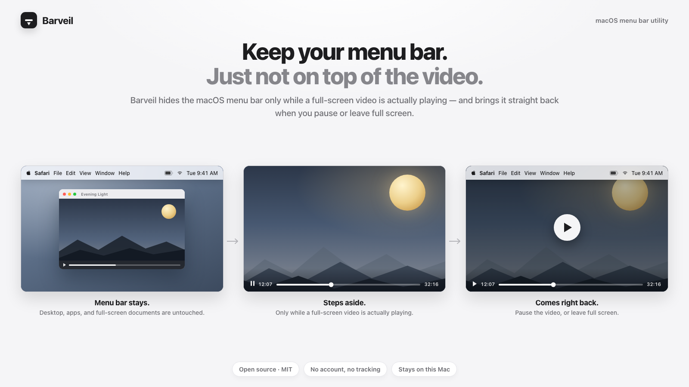
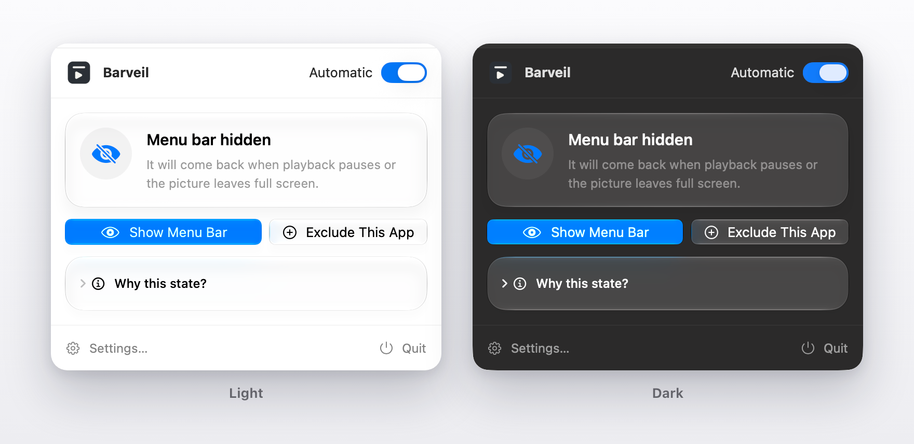
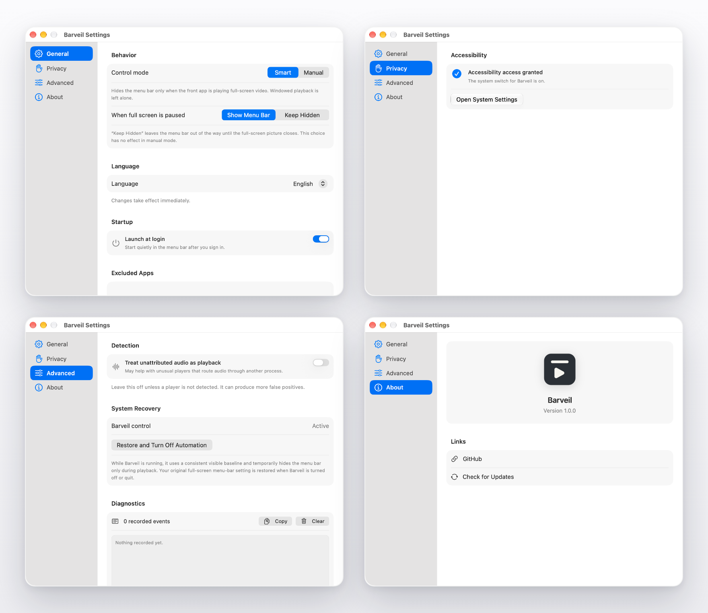

# Barveil

[](https://github.com/CC5103/Barveil/actions/workflows/ci.yml)
[](https://github.com/CC5103/Barveil/releases/latest)
[](LICENSE)
[](#requirements)

**English** | [简体中文](docs/README.zh-CN.md) | [日本語](docs/README.ja.md)

<p align="center">
  
</p>

<h3 align="center">Keep the menu bar. Just not on top of the video.</h3>

<p align="center">
  Barveil hides the macOS menu bar only while a full-screen video is actually playing —
  and brings it straight back when you pause or leave full screen.
</p>

<p align="center">
  <a href="#install">Install</a> ·
  <a href="#features">Features</a> ·
  <a href="#how-it-works">How it works</a> ·
  <a href="#build-from-source">Build</a> ·
  <a href="https://github.com/CC5103/Barveil">GitHub</a>
</p>

<p align="center">
  
</p>

## What Barveil does

| When | The menu bar |
| --- | --- |
| Desktop, apps, full-screen documents, windowed video | Stays exactly as you keep it |
| A full-screen video is **actually playing** | Steps aside for the picture |
| You pause the video (still in full screen) | Comes straight back — the default |
| The video leaves full screen | Stays with you |
| Barveil is off, or you quit it | Your original macOS setting is restored |

The menu bar is hidden **only** while a full-screen video is really playing. Everything
else — the desktop, apps, even full-screen documents — keeps the menu bar right where you
put it, and the moment playback pauses, it is back. No toggling, no shortcut to remember.
(If you would rather keep the bar hidden while paused, that is a setting.)

## Is Barveil for you?

**Barveil is for you if you keep the menu bar visible on purpose** — for the clock and
status icons, or because full screen simply looks better with it on a MacBook with a
notch. The one place you don't want it: on top of a full-screen video.

macOS's built-in setting can't express that. It is all-or-nothing, and people have been
asking Apple for the missing option for years:

- [“I want the menu bar all the time except when a video is playing fullscreen.”](https://www.reddit.com/r/MacOS/comments/vl1klr) — r/MacOS
- [“I can't believe Apple hasn't developed a feature to turn off the menu bar when you're in a fullscreen video.”](https://www.reddit.com/r/mac/comments/sk49mp) — r/mac
- [“The dock and menu bar remain visible, covering the top and bottom parts of the video.”](https://apple.stackexchange.com/questions/135724/full-screen-youtube-still-shows-dock-and-menu-bar) — Ask Different
- Apple Community even has a thread titled [“Hide the menu bar only during fullscreen video playback.”](https://discussions.apple.com/thread/255073308)

**You probably don't need Barveil if** you already hide the menu bar everywhere, or you
never watch videos in full screen.

## Why Barveil

macOS's *Automatically hide and show the menu bar* setting is all-or-nothing: the menu
bar stays visible everywhere — including on top of full-screen video — or it hides
everywhere. There is no “keep it, except while the video plays” in between.

Barveil adds exactly that missing option, and stays deliberately narrow: it waits until
the frontmost app is actually producing playback *and* the picture really fills the
display. Full-screen documents, games, and ordinary windows keep their menu bar. Some
menu-bar utilities hide the bar for every full-screen window; Barveil does not.

No account. No analytics. No “smart” cloud service.

## Features

- **Only while playing** — the menu bar hides only when a full-screen video is actually
  playing; desktop, apps, full-screen documents, and windowed video are untouched.
- **Back on pause** — pause the video or leave full screen and the menu bar returns
  immediately. Prefer to keep it hidden while paused? That is one setting away.
- **Notch-friendly** — on a MacBook with a notch, the menu bar can keep filling the top
  row; Barveil clears it only for actual playback.
- **Browser-aware** — Safari, Chrome, and other browsers are handled conservatively;
  Accessibility access improves exact browser-content detection.
- **Manual control** — use the menu-bar panel or the global shortcut when you want to
  override automatic behavior for the current app.
- **App exceptions** — keep automation away from apps where you prefer manual control.
- **Native settings** — a compact sidebar with General, Privacy, Advanced, and Info.
- **Local-first** — preferences and the short diagnostics log stay on this Mac.
- **No Dock icon** — Barveil lives in the menu bar.

## Screenshots

<p align="center">
  <b>The panel</b> — light and dark, shown while it is hiding the bar for a full-screen video.
</p>

<p align="center">
  
</p>

<p align="center">
  <b>Settings</b> — General, Privacy, Advanced, and About.
</p>

<p align="center">
  
</p>

## Install

### Requirements

- macOS 14.4 or later
- Accessibility access is optional, but recommended for exact browser detection

### Download

Download the latest `Barveil-<version>.dmg` or `Barveil-<version>.zip` from
[GitHub Releases](https://github.com/CC5103/Barveil/releases/latest), then drag
`Barveil.app` into `Applications`.

The free builds are ad-hoc signed and not notarized. On first launch, right-click
`Barveil.app` and choose **Open**. If macOS says the app is damaged, remove the
quarantine attribute once:

```bash
xattr -dr com.apple.quarantine /Applications/Barveil.app
```

## Usage

1. Launch Barveil and click the menu-bar icon.
2. Keep **Automatic** enabled, and leave your menu bar setting as it is — Barveil only
   changes it during playback.
3. Play a video in full screen; the menu bar steps aside.
4. Pause the video or leave full screen; the menu bar comes right back.
5. If an app should never be automated, add it to **General → Excluded Apps**.

## Permissions and privacy

- Barveil uses macOS Accessibility access only to distinguish a full-screen browser
  window from a video that fills the browser content area.
- On first use, macOS shows its own registration prompt. Barveil does not open System
  Settings at the same time; you choose when to continue.
- If Barveil is not listed in Accessibility, use the `+` button in System Settings.
- Barveil does not read page content, passwords, messages, or files.
- The app does not require an account and does not collect analytics.
- Barveil itself makes no network requests. **Info → Check for Updates** opens the
  GitHub Releases page in your browser.

## How it works

Barveil combines several local signals:

1. the frontmost application and its windows;
2. whether macOS is showing a native full-screen Space;
3. whether a browser still has its chrome or the picture fills the content area;
4. whether the app is actually producing playback.

The detectors can briefly disagree while entering or leaving full screen, so a
stabilizer waits for the state to settle before touching the system setting. When the
answer is uncertain, Barveil keeps the menu bar visible instead of guessing.

## Settings

| Page | What it contains |
| --- | --- |
| **General** | Control mode, paused behavior, language, launch at login, app exceptions |
| **Privacy** | Accessibility status and a direct link to System Settings |
| **Advanced** | Unusual-player detection, system recovery, diagnostics |
| **Info** | Version, GitHub, and Check for Updates |

The app menu's **About Barveil** item opens the Info page.

## Build from source

Requirements:

- macOS 14.4 or later
- Xcode 26 or later

```bash
git clone https://github.com/CC5103/Barveil.git
cd Barveil

# Debug build (ad-hoc signed)
./scripts/build.sh Debug

# Release build
./scripts/build.sh Release

# Run all tests
./scripts/test.sh

# Build zip + dmg + SHA256SUMS
./scripts/package.sh
```

For a Developer ID signed and notarized build, use
[`scripts/notarize.sh`](scripts/notarize.sh); its header documents the required
credentials and environment variables.

## GitHub Actions

- **Build and Test** runs on pushes to `main`, pull requests, and manual dispatches.
- **Package** runs on `v*` tags or manually. It builds the zip, dmg, and checksums;
  tag runs publish them to the matching GitHub Release.

## Contributing

Issues and pull requests are welcome. Before opening a PR:

```bash
./scripts/test.sh
```

When changing detection behavior, keep the default conservative: a missed hide is
better than hiding the menu bar when no video is playing.

## License

MIT © 2026 Yunhao Zhou. See [`LICENSE`](LICENSE).

---

If Barveil makes full-screen video nicer on your Mac, consider
[starring the repository](https://github.com/CC5103/Barveil) — it helps other people
find it.
