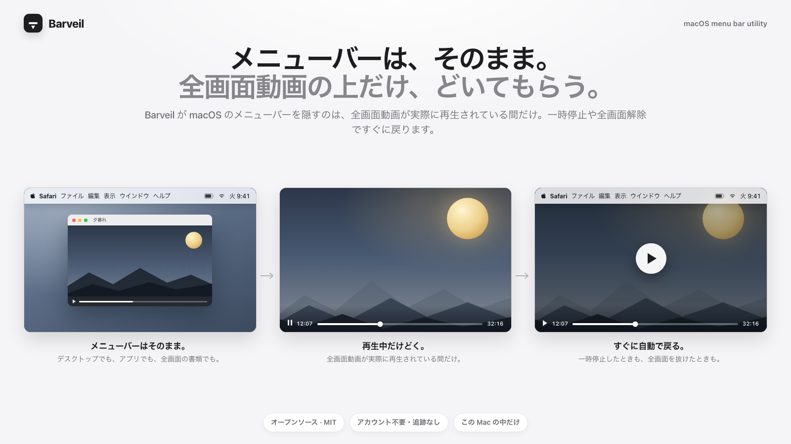
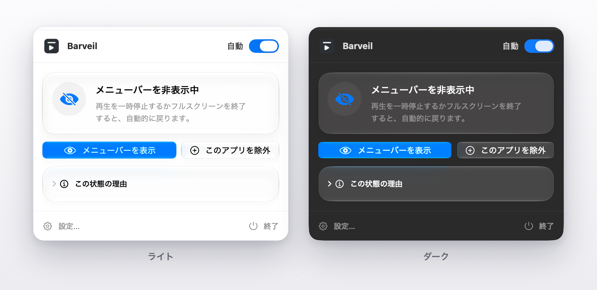
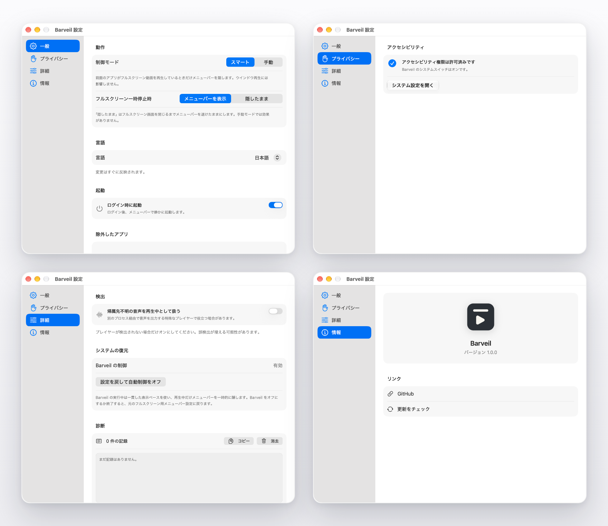

# Barveil

[](https://github.com/CC5103/Barveil/actions/workflows/ci.yml)
[](https://github.com/CC5103/Barveil/releases/latest)
[](../LICENSE)
[](#動作環境)

[English](../README.md) | [简体中文](README.zh-CN.md) | **日本語**

<p align="center">
  
</p>

<h3 align="center">メニューバーはそのまま。全画面動画の上だけ、どいてもらう。</h3>

<p align="center">
  Barveil が macOS のメニューバーを隠すのは、全画面動画が実際に再生されている間だけ。
  一時停止や全画面解除ですぐに戻ります。
</p>

<p align="center">
  <a href="#インストール">インストール</a> ·
  <a href="#機能">機能</a> ·
  <a href="#仕組み">仕組み</a> ·
  <a href="#ソースからビルド">ビルド</a> ·
  <a href="https://github.com/CC5103/Barveil">GitHub</a>
</p>

<p align="center">
  
</p>

## Barveil の実際の動作

| 状況 | メニューバー |
| --- | --- |
| デスクトップ、アプリ、全画面の書類、ウインドウ再生 | 設定どおり、そのまま表示 |
| 全画面動画が**実際に再生中** | どいて、映像を邪魔しない |
| 全画面動画を一時停止（全画面のまま） | すぐ戻る（デフォルト） |
| 動画が全画面を抜ける | ずっとそのまま |
| Barveil をオフまたは終了 | 元の macOS 設定に復元 |

メニューバーが隠れるのは、全画面動画が実際に再生されている間だけ。デスクトップでも、
アプリでも、全画面の書類でも、メニューバーはいつもの場所にあります。再生を止めれば
すぐに戻り、手動操作もショートカットも要りません。
（一時停止中も隠したままにしたい場合は、設定で変更できます。）

## Barveil が必要かどうか

**メニューバーをあえて表示したままにしている人** のためのアプリです。
時計やステータスをいつでも見たい。ノッチ付きの MacBook では、全画面でもメニューバーが
あった方がしっくりくる。でも、全画面動画の上にだけは乗ってほしくない。

macOS 標準の「メニューバーを自動的に隠す・表示する」は 0 か 100 かです。どこでも
表示するか、どこでも隠すか。その中間はありません。この「間」を求める声は、何年も
前から Apple に届いています：

- [「動画を全画面で見ているとき以外は、メニューバーをずっと出しておきたい。」](https://www.reddit.com/r/MacOS/comments/vl1klr)（r/MacOS より）
- [「全画面動画のときにメニューバーを消す機能を Apple がまだ作っていないなんて信じられない。」](https://www.reddit.com/r/mac/comments/sk49mp)（r/mac より）
- [「動画は全画面になったのに Dock とメニューバーが残ったまま、映像の上下を覆っている。」](https://apple.stackexchange.com/questions/135724/full-screen-youtube-still-shows-dock-and-menu-bar)（Ask Different より）
- Apple コミュニティには [「全画面動画の再生中だけメニューバーを隠す」](https://discussions.apple.com/thread/255073308) というタイトルのスレッドもあります。

**メニューバーを常に隠す設定に満足している場合や、全画面動画を見ない場合は、
Barveil は必要ないかもしれません。**

## なぜ Barveil が必要か

macOS の「メニューバーを自動的に隠す・表示する」は 0 か 100 かです。メニューバーは
全画面動画の上も含めてどこにでも表示されるか、どこでも隠されるかのどちらかで、
「表示したまま、動画のときだけどいてもらう」という中間はありません。

Barveil が足すのは、まさにその中間の選択肢です。しかも対象は意図的に狭くしています。
前面のアプリが本当に映像を再生していて、しかも映像が実際にディスプレイを埋めている
ときだけメニューバーを隠します。全画面の書類、ゲーム、通常のウインドウではそのまま。
すべての全画面ウインドウで隠してしまうツールもありますが、Barveil は違います。

アカウントも分析も、クラウド上の「スマート判定」もありません。

## 機能

- **再生中だけ隠れる** — 全画面動画が実際に再生されているときだけメニューバーが
  隠れます。デスクトップ、アプリ、全画面の書類、ウインドウ再生はそのまま。
- **一時停止ですぐ戻る** — 一時停止または全画面解除でメニューバーがすぐ戻ります。
  一時停止中も隠したままにしておくこともできます。
- **ノッチ搭載 Mac にやさしい** — ノッチ付き MacBook ではメニューバーが上部の行を
  埋めたまま。Barveil は実際に再生している間だけどけます。
- **ブラウザ対応** — Safari、Chrome などを保守的に判定します。アクセシビリティ
  権限があると、ブラウザ内容の全画面判定がより正確になります。
- **手動操作** — 現在のアプリで自動動作を上書きしたいときはメニューバーパネルや
  グローバルショートカットを使えます。
- **アプリの例外** — 自動処理したくないアプリを例外リストに追加できます。
- **ネイティブ設定** — 一般、プライバシー、詳細、情報というコンパクトな構成。
- **ローカル優先** — 設定と短い診断ログはこの Mac の中だけに保存されます。
- **Dock アイコンなし** — メニューバーだけで動作します。

## スクリーンショット

<p align="center">
  <b>メニューバーパネル</b> — ライトとダーク。全画面動画のためにバーを隠している状態です。
</p>

<p align="center">
  
</p>

<p align="center">
  <b>設定</b> — 一般、プライバシー、詳細、情報。
</p>

<p align="center">
  
</p>

## インストール

### 動作環境

- macOS 14.4 以降
- アクセシビリティ権限は任意ですが、ブラウザの正確な検出には推奨されます

### ダウンロード

[GitHub Releases](https://github.com/CC5103/Barveil/releases/latest) から最新の
`Barveil-<version>.dmg` または `Barveil-<version>.zip` をダウンロードし、
`Barveil.app` を `アプリケーション` フォルダへ移動してください。

無料ビルドは ad-hoc 署名で、Apple の公証は受けていません。初回起動時は
`Barveil.app` を右クリックして **開く** を選んでください。macOS が「壊れている」
と表示する場合は、次のコマンドを一度実行します。

```bash
xattr -dr com.apple.quarantine /Applications/Barveil.app
```

## 使い方

1. Barveil を起動し、メニューバーアイコンをクリックします。
2. **自動** をオンにして、メニューバーの設定はそのままで構いません。
   Barveil は再生中だけ変更します。
3. 全画面で動画を再生すると、メニューバーがどきます。
4. 一時停止または全画面解除で、メニューバーがすぐ戻ります。
5. 自動処理したくないアプリは **一般 → 除外したアプリ** に追加します。

## 権限とプライバシー

- アクセシビリティ権限は、ブラウザのウインドウ全画面と、内容領域を埋める動画の
  全画面を区別するためだけに使用します。
- 初回は macOS のネイティブ登録プロンプトが表示されます。Barveil が同時に
  システム設定を自動で開くことはありません。
- システム設定に Barveil が表示されない場合は、`+` で手動追加してください。
- ページ内容、パスワード、メッセージ、ファイルは読み取りません。
- アカウントは不要で、分析データも収集しません。
- Barveil 自体はネットワーク通信を行いません。**情報 → 更新をチェック** は
  ブラウザで GitHub Releases を開くだけです。

## 仕組み

Barveil は次のローカル信号を組み合わせます。

1. 前面のアプリとそのウインドウ
2. macOS がネイティブの全画面 Space を表示しているか
3. ブラウザのツールバーが残っているか、映像が内容領域を埋めているか
4. アプリが実際に再生しているか

全画面の開始・終了時には信号が一瞬矛盾することがあるため、状態が安定するまで
待ってからシステム設定を変更します。判断に迷う場合は、誤って隠すのではなく
メニューバーを表示したままにします。

## 設定

| ページ | 内容 |
| --- | --- |
| **一般** | 制御モード、一時停止時の動作、言語、ログイン時に起動、アプリ例外 |
| **プライバシー** | アクセシビリティの状態とシステム設定への入口 |
| **詳細** | 特殊なプレイヤーの検出、システム復元、診断ログ |
| **情報** | バージョン、GitHub、更新チェック |

アプリメニューの **Barveil について** から情報ページを開けます。

## ソースからビルド

必要なもの：

- macOS 14.4 以降
- Xcode 26 以降

```bash
git clone https://github.com/CC5103/Barveil.git
cd Barveil

# Debug ビルド（ad-hoc 署名）
./scripts/build.sh Debug

# Release ビルド
./scripts/build.sh Release

# すべてのテスト
./scripts/test.sh

# zip + dmg + SHA256SUMS を作成
./scripts/package.sh
```

Developer ID 署名と公証については
[`../scripts/notarize.sh`](../scripts/notarize.sh) のスクリプト説明を参照してください。

## GitHub Actions

- **Build and Test**：`main` への push、Pull Request、手動実行でビルドとテストを
  実行します。
- **Package**：`v*` tag または手動実行で zip、dmg、チェックサムを作成します。
  tag 実行時は対応する GitHub Release にアップロードします。

## コントリビューション

Issue と Pull Request を歓迎します。PR の前に次を実行してください。

```bash
./scripts/test.sh
```

検出ロジックを変更するときは、保守的な動作を優先してください。動画を再生して
いないのにメニューバーを隠すより、一度隠し損ねる方が安全です。

## ライセンス

MIT © 2026 Yunhao Zhou。詳細は [`LICENSE`](../LICENSE) を参照してください。

---

Barveil が役に立ったら、ぜひ
[リポジトリに Star](https://github.com/CC5103/Barveil) をお願いします。
