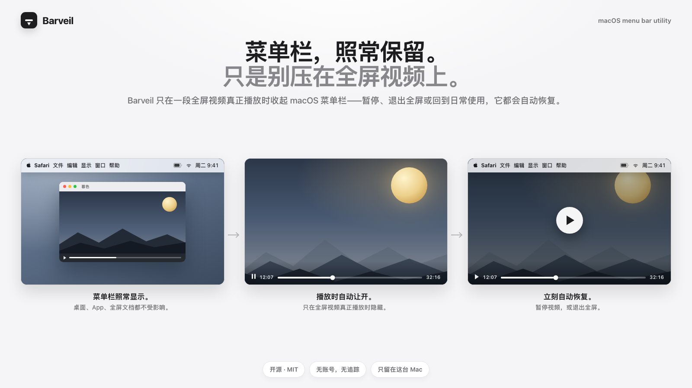
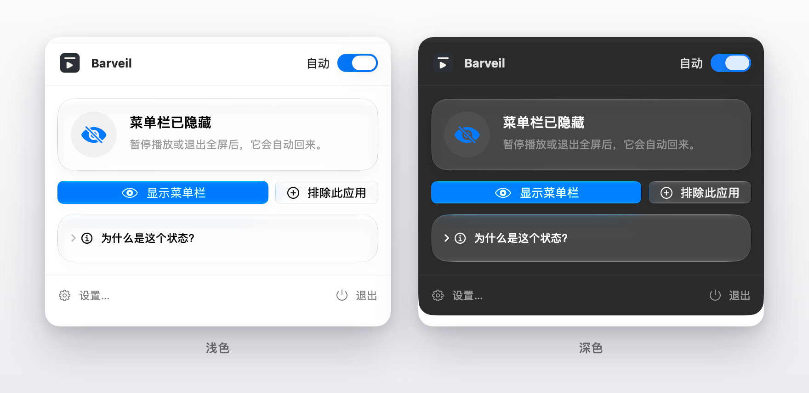
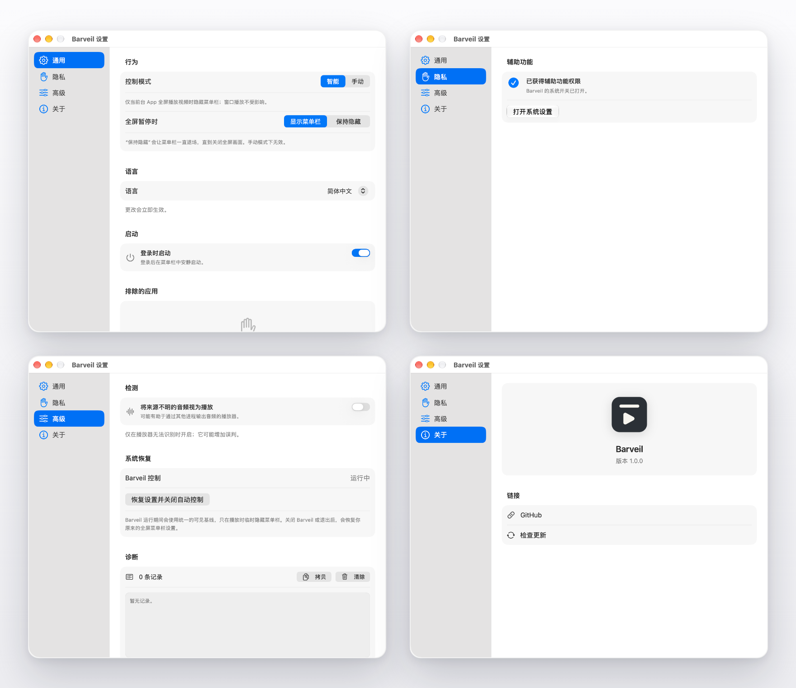

# Barveil

[](https://github.com/CC5103/Barveil/actions/workflows/ci.yml)
[](https://github.com/CC5103/Barveil/releases/latest)
[](../LICENSE)
[](#系统要求)

[English](../README.md) | **简体中文** | [日本語](README.ja.md)

<p align="center">
  
</p>

<h3 align="center">菜单栏照常保留，只是别压在全屏视频上。</h3>

<p align="center">
  Barveil 只在一段全屏视频真正播放时收起 macOS 菜单栏——
  暂停、退出全屏或回到日常使用，它都会自动恢复。
</p>

<p align="center">
  <a href="#安装">安装</a> ·
  <a href="#功能">功能</a> ·
  <a href="#工作方式">工作方式</a> ·
  <a href="#从源码构建">构建</a> ·
  <a href="https://github.com/CC5103/Barveil">GitHub</a>
</p>

<p align="center">
  
</p>

## Barveil 的实际表现

| 什么时候 | 菜单栏 |
| --- | --- |
| 桌面、App、全屏文档、窗口播放视频 | 完全按你的设置照常显示 |
| 全屏视频**真正播放中** | 让开，把画面留给视频 |
| 全屏视频暂停（仍处于全屏） | 立刻回来（默认行为） |
| 视频退出全屏 | 一直保留 |
| 关闭或退出 Barveil | 恢复你原本的 macOS 设置 |

也就是说，菜单栏**只**在全屏视频真正播放时隐藏。其他任何时候——桌面、App、甚至全屏
文档——菜单栏都待在原处；画面一暂停，它马上就回来。不用手动开关，也不用记快捷键。
（如果你希望暂停时也保持隐藏，可以在设置里改。）

## Barveil 适合你吗？

**如果你是有意让菜单栏一直显示的人，Barveil 就是为你准备的。**
也许你喜欢随时瞟一眼时间与状态图标，也许你觉得带刘海的 MacBook 在全屏时保留菜单栏
更顺眼——但全屏视频一开始，macOS 就把菜单栏压在画面上。系统自带的「自动隐藏并显示
菜单栏」只有全有或全无：要么哪里都显示，要么哪里都隐藏。

这正是 Barveil 补上的缺口。多年以来一直有人向 Apple 提这个需求：

- [「我想要菜单栏一直显示——除了在全屏看视频的时候。」](https://www.reddit.com/r/MacOS/comments/vl1klr)（译自 r/MacOS）
- [「真不敢相信 Apple 到现在都没有做『看全屏视频时关掉菜单栏』这个功能。」](https://www.reddit.com/r/mac/comments/sk49mp)（译自 r/mac）
- [「视频虽然进了全屏，但 Dock 和菜单栏还留在那里，挡住了画面的上下部分。」](https://apple.stackexchange.com/questions/135724/full-screen-youtube-still-shows-dock-and-menu-bar)（译自 Ask Different）
- Apple 社区里还有一条帖子，标题就叫 [「只在全屏视频播放时隐藏菜单栏」](https://discussions.apple.com/thread/255073308)。

**如果你已经习惯让菜单栏到处隐藏，或者几乎不看全屏视频，那可能用不上 Barveil。**

## 为什么需要 Barveil

macOS 的「自动隐藏并显示菜单栏」是全有或全无的：菜单栏要么到处都在——包括压在
全屏视频上；要么到处都消失。没有「保留它，只在看视频时让开」这个中间选项。

Barveil 补上的正是这个选项，而且刻意把范围收窄：只有前台 App 真的在输出播放、
画面真的填满显示器时，它才让菜单栏退场。全屏文档、游戏和普通全屏窗口都保持原样。
一些菜单栏工具会对所有全屏窗口隐藏菜单栏，Barveil 不会。

不需要账号，不做分析，也不依赖云端「智能判断」。

## 功能

- **只在播放时隐藏**：只有当全屏视频真正播放时才会收起菜单栏；桌面、App、全屏文档和窗口播放视频都不受影响。
- **暂停就回来**：暂停视频或退出全屏，菜单栏立刻恢复；想暂停时也保持隐藏，改一个设置即可。
- **刘海屏友好**：在带刘海的 MacBook 上，菜单栏可以继续填满顶部一行；Barveil 只在真正播放视频时收起它。
- **浏览器场景友好**：Safari、Chrome 等浏览器采用保守策略；辅助功能权限可提升
  浏览器内容全屏的精确判断。
- **手动控制**：需要覆盖当前 App 的自动行为时，可使用菜单栏面板或全局快捷键。
- **应用例外**：不希望自动处理某个 App 时，把它加入例外清单。
- **原生设置**：紧凑的侧边栏结构：通用、隐私、高级、信息。
- **本地优先**：偏好和短期诊断日志只保存在这台 Mac 上。
- **不占 Dock**：Barveil 只存在于菜单栏。

## 截图

<p align="center">
  <b>菜单栏面板</b>——浅色与深色，图中正在为全屏视频让开菜单栏。
</p>

<p align="center">
  
</p>

<p align="center">
  <b>设置</b>——通用、隐私、高级、信息。
</p>

<p align="center">
  
</p>

## 安装

### 系统要求

- macOS 14.4 或更高版本
- 辅助功能权限为可选项，但建议开启以获得精确的浏览器检测

### 下载

从 [GitHub Releases](https://github.com/CC5103/Barveil/releases/latest) 下载最新的
`Barveil-<版本>.dmg` 或 `Barveil-<版本>.zip`，把 `Barveil.app` 拖进
`应用程序` 文件夹。

免费构建使用 ad-hoc 签名，未经过 Apple 公证。第一次启动时请右键点击
`Barveil.app`，选择 **打开**。如果 macOS 提示 App 已损坏，执行一次：

```bash
xattr -dr com.apple.quarantine /Applications/Barveil.app
```

## 使用

1. 启动 Barveil，点击菜单栏图标。
2. 保持 **自动** 开启，菜单栏设置也保持原样——Barveil 只在播放期间临时改动它。
3. 全屏播放视频，菜单栏会主动让开。
4. 暂停视频或退出全屏，菜单栏马上回来。
5. 如果某个 App 不应被自动处理，在 **通用 → 排除的 App** 中加入它。

## 权限与隐私

- Barveil 只使用辅助功能权限来区分“浏览器窗口全屏”和“视频内容全屏”。
- 首次使用时由 macOS 显示原生注册提示；Barveil 不会同时自动打开系统设置。
- 如果系统设置里没有列出 Barveil，请用 `+` 手动添加。
- Barveil 不读取网页内容、密码、消息或文件。
- 不需要账号，不收集分析数据。
- Barveil 本身不发起网络请求；**信息 → 检查更新** 只会在浏览器中打开 GitHub
  Releases 页面。

## 工作方式

Barveil 综合以下本机信号：

1. 前台 App 及其窗口；
2. macOS 是否处于原生全屏 Space；
3. 浏览器是否仍显示标签栏、地址栏或工具栏，或者画面是否填满内容区域；
4. App 是否真的正在播放。

进入或退出全屏的瞬间，信号可能短暂冲突，因此稳定器会等状态稳定后再修改系统设置。
遇到不确定情况时，Barveil 会保持菜单栏可见，而不是冒险隐藏。

## 设置

| 页面 | 内容 |
| --- | --- |
| **通用** | 控制模式、暂停行为、语言、登录时启动、应用例外 |
| **隐私** | 辅助功能状态和系统设置入口 |
| **高级** | 特殊播放器检测、系统恢复、诊断日志 |
| **信息** | 版本、GitHub、检查更新 |

应用菜单中的 **关于 Barveil** 会打开信息页。

## 从源码构建

要求：

- macOS 14.4 或更高版本
- Xcode 26 或更高版本

```bash
git clone https://github.com/CC5103/Barveil.git
cd Barveil

# Debug 构建（ad-hoc 签名）
./scripts/build.sh Debug

# Release 构建
./scripts/build.sh Release

# 运行全部测试
./scripts/test.sh

# 生成 zip + dmg + SHA256SUMS
./scripts/package.sh
```

Developer ID 签名与公证流程见 [`../scripts/notarize.sh`](../scripts/notarize.sh) 的脚本说明。

## GitHub Actions

- **Build and Test**：在 `main` push、Pull Request 或手动触发时运行构建和测试。
- **Package**：在 `v*` tag 或手动触发时生成 zip、dmg 和校验文件；tag 执行会发布
  到对应的 GitHub Release。

## 贡献

欢迎提交 Issue 和 Pull Request。提交 PR 前请先运行：

```bash
./scripts/test.sh
```

修改检测逻辑时请保持保守：漏掉一次隐藏，也比在没有视频播放时错误隐藏菜单栏好。

## 许可证

MIT © 2026 Yunhao Zhou。详见 [`LICENSE`](../LICENSE)。

---

如果 Barveil 让你的全屏视频体验更好，欢迎
[给项目点一个 Star](https://github.com/CC5103/Barveil)。
